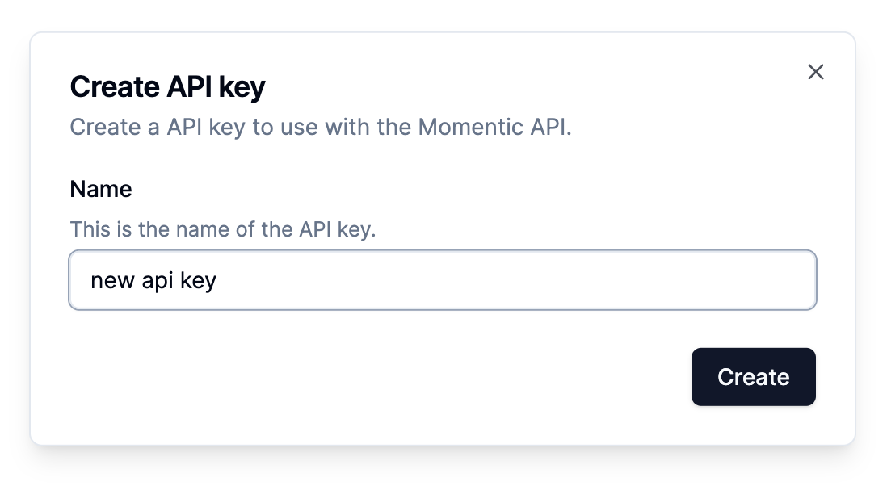

# Momentic Run Tests GitHub Action

## Prerequisites

### Create a Momentic API key

For this action to communicate securely with Momentic, you'll need to create a
new API key. In Momentic, navigate to: API key.

Give your new API key a name (for example, "GitHub Action Run Tests).



Click Create and copy your token, which you’ll use as your `MOMENTIC_API_KEY`.
We recommend you store this as an
[encrypted secret](https://docs.github.com/en/actions/security-guides/using-secrets-in-github-actions).

## Usage

Adding the following to your workflow will create new test run for the specified
test.

```yaml
- uses: actions/checkout@v3
  with:
    fetch-depth: 0

- name: Run tests using Momentic
  uses: momentic-ai/run-tests@latest
  env:
    MOMENTIC_API_KEY: ${{ secrets.MOMENTIC_API_KEY }}
  with:
    test-id: 8f20cad6-2fd5-4019-bcbc-26fb617f36c5
```

### Inputs

#### Environment Variables

| name               | description                                       | default |
| ------------------ | ------------------------------------------------- | ------- |
| `MOMENTIC_API_KEY` | **[Required]** Authentication token for Momentic. | -       |

#### Parameters

| name      | description                    | default |
| --------- | ------------------------------ | ------- |
| `test-id` | ID of the test you want to run |
